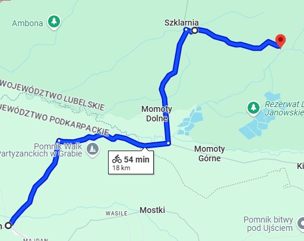

<html lang="pl">
<head>
  <meta charset="utf-8">
  <title>Wycieczka Rowerowa</title>
  <meta name="description" content="Szlak Rowerowy SLO">
  <meta name="keywords" content="rower, pies, mambo żambo">
  <meta http-equiv="X-UA-Compatible" content="IE=edge,chrome=1">
  
</head>
<body>
  

    

      <h1>Komponenty komputerowe</h1>
    

    

     <a href="http://turystyka-nizanski.pl/historyczny-gminy-jarocin/"> Strona Trasy </a> 
   
    

    

      <h2>Wycieczka-Szlak dziedzictwa kulturowego Jarocin</h2>
      

      Szlak oferuje przepiękne kraj obrazy lasu oraz aglomeracji miejscowości z klimatem 20-lecia międzywojennego
      Oferuje też kawał historii, trasę partyzantów Ojca Jana jednego z dowódców partyzantów tej część polski 
      Oprócz tego w tych lasach krył się jeden z legend naszych okolic Jana Kossaka psełdonim "Harnaś"
      na szlaku bedziemy przejeżdżać przez miejscowoście takie jak
        - Jarocin 
        - Nalepy  
        - Szklarnia  
        - Momoty Górne  
      
      Celem jest dotarcie na miejsce pamięci Porytowe Wzgórze
      <h2> Atrakcje </h2>
      Podczas wycieczki odbywać gra terenowa przygotowana przez wojsko z bazy Nisko
      wszystkie punkty będą zaznaczone na mapie którą każdy uczestnik dostanie na początek wyprawy.
      Będą szkolenia z obsługi broni i obsługi wojskowego sprzętu
        
      Organizatorzy oferują też dla uczestników na końcu trasy piknik i ogńsko

      
      
      

    
    

    

      
    

 
   
    

       Wycieczka Rowerowa- Michu 3301 &copy; Wszelkie prawa zastrzeżone
    

  

</body>
</html>
